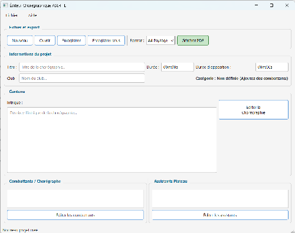

# Manuel d'utilisation — Éditeur Chorégraphique ASL-FFE v2

---

## Table des matières

1. [Présentation](#1-présentation)
2. [Installation et lancement](#2-installation-et-lancement)
3. [Interface principale](#3-interface-principale)
4. [Créer un nouveau projet](#4-créer-un-nouveau-projet)
5. [Gérer les combattants](#5-gérer-les-combattants)
6. [Gérer les assistants plateau](#6-gérer-les-assistants-plateau)
7. [Éditer la chorégraphie](#7-éditer-la-chorégraphie)
8. [Les phrases d'armes](#8-les-phrases-darmes)
9. [Les actions et mouvements](#9-les-actions-et-mouvements)
10. [Sauvegarder et ouvrir un projet](#10-sauvegarder-et-ouvrir-un-projet)
11. [Exporter en PDF](#11-exporter-en-pdf)
12. [Personnaliser les options de mouvements](#12-personnaliser-les-options-de-mouvements)
13. [Compatibilité des fichiers V1](#13-compatibilité-des-fichiers-v1)

---

## 1. Présentation

L'**Éditeur Chorégraphique ASL-FFE** est un logiciel destiné aux clubs des sabre laser ASL-FFE mais il peut etre adapter pour l'escrime artistique. Il permet de :

- Rédiger et structurer des chorégraphies d'escrime (Kata, Duel, Bataille, Ensemble)
- Décrire précisément les mouvements de chaque combattant action par action
- Sauvegarder les chorégraphies dans un fichier XML portable (format `.chore`)
- Exporter la chorégraphie complète en PDF pour la soumettre aux juges ou l'imprimer

Le logiciel fonctionne sur **Windows, macOS et Linux** sans aucune installation supplémentaire (version compilée).

---

## 2. Installation et lancement

### Version compilée (recommandée)

Double-cliquer sur l'exécutable correspondant à votre système :

| Système | Fichier |
|---|---|
| Windows | `EditeurChoreASL.exe` |
| macOS | `EditeurChoreASL` |
| Linux | `main.py` |

> **Note Windows :** Au premier lancement, Windows Defender peut afficher un avertissement. Cliquer sur **"Informations complémentaires"** puis **"Exécuter quand même"**.

> **Note macOS :** Au premier lancement, macOS peut bloquer l'application. Faire un **clic droit → Ouvrir** pour autoriser l'exécution.

> **Note Linux :** Pas d'executable pour le moment il faut installer pyton et ces dépendance pour executer le logiciel

### Version source (Python)

```bash
pip install -r requirements.txt
python main.py
```

---

## 3. Interface principale

À l'ouverture, la fenêtre principale se présente ainsi :



> L'interface s'adapte aussi en mode sombre

### Zones de l'interface

| Zone | Description |
|---|---|
| **Barre de fichier** | Création, ouverture, sauvegarde du projet et export PDF |
| **Informations projet** | Titre, durée, club, catégorie calculée automatiquement |
| **Intrigue** | Description narrative libre de la chorégraphie |
| **Chorégraphie** | Bouton d'accès à l'éditeur de phrases d'armes et d'actions |
| **Combattants** | Liste des escrimeurs du projet |
| **Assistants** | Liste des assistants plateau |

---

## 4. Créer un nouveau projet

1. Cliquer sur **Nouveau** (ou `Ctrl+N`)
2. Remplir les informations générales :
   - **Titre** : nom de la chorégraphie
   - **Club** : nom du club présentant la chorégraphie
   - **Durée** : durée totale au format `03m:45s` par défaut mais peut etre ecrit `250s` 
   - **Durée d'opposition** : durée de la phase d'opposition au même format
   - **Intrigue** : texte libre décrivant le scénario mais aussi les musique utilisé et tout autre information complémentaire qu'il faut transmetre.
3. Ajouter les combattants (voir section 5)
4. La **catégorie** est calculée automatiquement selon le nombre de combattants :

| Nombre de combattants | Catégorie |
|---|---|
| 1 | Kata `Fonction créer avant la mise à jours du reglement 2025-2026`|
| 2 | Duel |
| 3 et plus | Bataille |
| 3 et plus + case `Mouvement d'ensemble` coché | Ensemble |

---

## 5. Gérer les combattants

Cliquer sur **Éditer les combattants** pour ouvrir le gestionnaire.

### Ajouter un combattant

1. Remplir les champs **Nom** et **Prénom** (obligatoires)
2. Remplir le **Numéro de licence FFE** (optionnel)
3. Cocher **Capitaine** si applicable
4. Cliquer sur **Ajouter**

### Modifier un combattant

1. Sélectionner le combattant dans la liste de gauche
2. Modifier les champs dans le formulaire de droite
3. Cliquer sur **Mettre à jour**

### Supprimer un combattant

1. Sélectionner le combattant dans la liste
2. Cliquer sur **Supprimer** et confirmer

> **Attention :** Supprimer un combattant ne supprime pas les mouvements qui lui sont associés dans les actions existantes. Il est recommandé de supprimer les combattants avant de saisir les actions.

Cliquer sur **Valider et fermer** pour appliquer les modifications.

---

## 6. Gérer les assistants plateau

Cliquer sur **Éditer les assistants** pour ouvrir le gestionnaire.

Le fonctionnement est identique à celui des combattants. Les champs disponibles sont :

| Champ | Obligatoire | Description |
|---|---|---|
| Nom | Oui | Nom de famille |
| Prénom | Oui | Prénom |
| Licence | Non | Numéro de licence FFE |
| Rôle | Non | Fonction dans la chorégraphie (ex : Assistant, Figurant) le texte est libre dans le cas ou la fédération ajouterais de nouveu roles |

---

## 7. Éditer la chorégraphie

Cliquer sur le bouton **Éditer la Chorégraphie** pour accéder à l'éditeur structuré.

La chorégraphie est organisée en deux niveaux imbriqués :

```
Chorégraphie
└── Phrase d'armes 1
│   ├── Action 1  (mouvements simultanés de tous les combattants)
│   ├── Action 2
│   └── Action 3
└── Phrase d'armes 2
    ├── Action 1
    └── Action 2
```

---

## 8. Les phrases d'armes

Une **phrase d'armes** est une section de la chorégraphie regroupant une séquence d'actions cohérentes (une attaque, une riposte, un désarmement…).

### Ajouter une phrase

1. Saisir une **description** dans le champ texte (obligatoire)
2. Cliquer sur **Ajouter phrase**

### Réordonner les phrases

Sélectionner une phrase et utiliser les boutons **▲ Monter** / **▼ Descendre**. Les numéros sont recalculés automatiquement.

### Modifier la description

1. Sélectionner la phrase dans la liste
2. Modifier le texte de description
3. Cliquer sur **Mettre à jour**

### Accéder aux actions d'une phrase

Sélectionner la phrase puis cliquer sur **Éditer les Actions →**.

---

## 9. Les actions et mouvements

Une **action** représente un instant T de la chorégraphie où tous les combattants effectuent leurs mouvements simultanément.

### Structure du tableau des actions

Le tableau affiche une ligne par action et un groupe de colonnes par combattant :

| Colonne | Description |
|---|---|
| **N°** | Numéro d'ordre de l'action |
| **Main D** | Technique de la main droite |
| **Zone MD** | Zone corporelle ciblée par la main droite |
| **Cible MD** *(si > 2 combattants)* | ID du combattant ciblé par la main droite |
| **Main G** | Technique de la main gauche |
| **Zone MG** | Zone corporelle ciblée par la main gauche |
| **Cible MG** *(si > 2 combattants)* | ID du combattant ciblé par la main gauche |
| **Déplacement** | Type de déplacement effectué |
| **Commentaire** | Note libre sur le mouvement |

> Les colonnes **Cible MD** et **Cible MG** n'apparaissent qu'à partir de 3 combattants, car elles n'ont de sens qu'en Bataille.

### Ajouter une action

Cliquer sur **+ Ajouter action**. Une nouvelle ligne vide est créée pour tous les combattants.

### Saisir un mouvement

Cliquer sur une cellule du tableau :
- Les colonnes **Main**, **Zone** et **Déplacement** proposent un menu déroulant issu du fichier `OptionsMouvements.csv`
- La colonne **Commentaire** est un champ texte libre
- Les colonnes **Cible** proposent les IDs des combattants disponibles

### Réordonner les actions

Sélectionner une ligne et utiliser **▲ Monter** / **▼ Descendre**.

### Supprimer une action

Sélectionner la ligne et cliquer sur **Supprimer action**.

---

## 10. Sauvegarder et ouvrir un projet

### Enregistrer

- **`Ctrl+S`** ou bouton **Enregistrer** : sauvegarde dans le fichier courant
- **`Ctrl+Shift+S`** ou **Enregistrer sous** : choisir un nouveau chemin

Les fichiers sont enregistrés au format `.chore` (XML lisible).
> si vous envoyer un fichier `.chore` si il a été remplis avec un CSV personnaliser il faudra aussi transmetre le fichier CSV sinon le second editeur ne pourras pas modifier le fichier

### Ouvrir

- **`Ctrl+O`** ou bouton **Ouvrir** : sélectionner un fichier `.chore`

> Si des modifications non sauvegardées existent, le logiciel propose de les enregistrer avant de continuer.

### Indicateur de modifications

Un astérisque `*` dans la barre de titre indique des modifications non sauvegardées :

```
Éditeur Chorégraphique ASL-FFE — ma choré *
```

---

## 11. Exporter en PDF

1. Sélectionner le **format de page** dans la liste déroulante :
   - A4 Paysage *(recommandé pour les tableaux larges)*
   - A4 Portrait
   - A3 Paysage
   - A3 Portrait
2. Cliquer sur **Générer PDF**
3. Choisir l'emplacement de sauvegarde du fichier

### Contenu du PDF généré

| Page | Contenu |
|---|---|
| **Page de garde** | Titre, club, catégorie, durées, intrigue, liste des combattants et assistants |
| **Une page par phrase** | Tableau complet des actions avec les mouvements de chaque combattant |

Affin de rester lisible si le tableau comporte plus de 8 action par phrase le logiciel ajoutera une seconde page a partir de la 9em acction et ainsi de suite

---

## 12. Personnaliser les options de mouvements

Les menus déroulants du tableau des actions sont alimentés par le fichier `OptionsMouvements.csv`, situé dans le dossier `_internal`.

### Format du fichier

Ouvrir avec un éditeur de texte (Notepad, TextEdit, gedit…) ou un tableur (Excel, LibreOffice Calc). Le séparateur est le **point-virgule** `;`.

```
Main;Deplacement;Zone
Attaque;Fente;Zone 1
Parade;Esquive;Zone 2
Estoc;Volte;Zone 3
Feinte;Balestra;Zone 1-2
```

- **Colonne Main** : alimente les menus "Main Droite" et "Main Gauche"
- **Colonne Deplacement** : alimente le menu "Déplacement"
- **Colonne Zone** : alimente les menus "Zone MD" et "Zone MG"

Les colonnes sont indépendantes : chaque ligne peut remplir une colonne sans remplir les autres.

> Redémarrer le logiciel après toute modification du CSV pour que les changements soient pris en compte.

>Garder toujours une ligne de donnée vide en haut pour pouvoir séléctionné une case vide dans les menu déroulant
---

## 13. Compatibilité des fichiers V1

Les fichiers `.chore` créés avec la **version 1 du logiciel (VB.NET / Windows uniquement)** sont entièrement compatibles avec la version 2. Il suffit de les ouvrir normalement via **Ouvrir**.

Les fichiers créés avec la V2 restent également lisibles par la V1.

---

*Éditeur Chorégraphique ASL-FFE — Version 2 | Sabre laser et Escrime Artistique*
